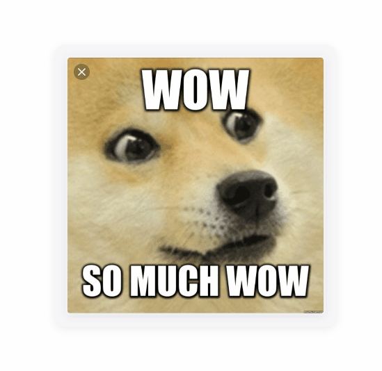

# OMG Whah is it ?!?!?

Is it a bird? Is it a PLANE?!

**NO.**

# It's the REAL-TIME SCREEN TRANSLATOR you didn't know you needed!



*IT SUPPORTS ROTATED TEXT?! YES! And even text that's UPSIDE DOWN?!?! UNBELIEVABLE!!!!*

## User Testimonials

We were overwhelmed with emotion when we received this feedback:

> **⭐⭐⭐⭐⭐ 10/10! This is the most life-changing application I have EVER seen!**
>
> — *shtrasser-dev*, a developer

## Get Started

1.  **Download:** Grab the latest `Zaya.ScreenTranslator-{version}.zip` from the [Releases](https://github.com/shtrasser-dev/Zaya.ScreenTranslator/releases/latest) page or use the `app-v1.1-latest` tag.
2.  **Extract:** Unzip the file anywhere you like.
3.  **Run:** Double-click `Zaya.ScreenTranslator.exe`.

### Build from Source
Want to contribute or see how the sausage is made? It's a standard .NET project.

```powershell
# Clone and build
git clone https://github.com/shtrasser-dev/Zaya.ScreenTranslator.git
cd Zaya.ScreenTranslator
build.cmd
```

# Zaya.ScreenTranslator

Real-time on-screen text translator for Windows 10/11. Captures a window or region, runs OCR, optionally translates, and shows the result in a text window or overlay.

## Version

**1.1.0** — Host channel `1.1`. See [versioning](docs/versioning.md).

Host release tags: `app-v1.1.0` / `app-v1.1-latest`. Plugin channels: `plugin-{Interface}-v{channel}-latest` (e.g. `plugin-Zaya.OCR-v1.1-latest`). Layout plugin (ships with host): `1.1.0.7`.

## Features

- Capture via Windows Graphics Capture plugin
- Per-profile capture / ignore regions (editor on the main window)
- OCR (OneOCR, Windows Media OCR) + proximity text layout
- Translation plugins (Google, Yandex) or built-in “No translation”
- In-memory translation cache plugin
- Overlay / text-window display modes
- UI languages: en, ru, de, fr, ja, ko, pl, pt, tr, uk, zh-Hans
- Per-application profiles
- Plugin updater via GitHub Releases; host opens the release page for app updates (does not self-replace the exe)

## Architecture

- **Impl.Windows** — Windows host (`Zaya.ScreenTranslator.exe`)
- **Impl.Shared** — Avalonia UI, pipeline, plugin loader, updater
- **Layout** / **Layout.Impl** — overlay layout abstractions + default Windows overlay engine (ships with the host)

## Dependencies

Pinned in `Directory.Build.props`:

| Package | Version |
|---------|---------|
| [Zaya.Primitives](https://github.com/shtrasser-dev/Zaya.Primitives) | 1.0.0 |
| [Zaya.Screenshot](https://github.com/shtrasser-dev/Zaya.Screenshot) | 1.1.0 |
| [Zaya.OCR](https://github.com/shtrasser-dev/Zaya.OCR) | 1.1.0 |
| [Zaya.Translator](https://github.com/shtrasser-dev/Zaya.Translator) | 1.1.0 |
| [Zaya.TranslatorCache](https://github.com/shtrasser-dev/Zaya.Translator) | 1.0.0 |

## Build

```bat
build.cmd
```

Publishes a single-file host and packs it into `out\Zaya.ScreenTranslator-{version}.zip` (contains `Zaya.ScreenTranslator.exe`). Also writes `out\version.txt` / `out\channel.txt`.

## Publish

GitHub Actions workflow **Publish** (`workflow_dispatch` only). Bump host version in `Directory.Build.props`, push, then run the workflow manually (optional **changelog** input becomes the GitHub Release notes). Creates/replaces `app-v{version}` and `app-v{channel}-latest` with `Zaya.ScreenTranslator-{version}.zip`.

## Local plugins

```bat
build-plugins.cmd
```

Builds sibling OCR / Screenshot / Translator (+ cache) plugin zips and copies them into `%AppData%\Zaya\ScreenTranslator\plugins`.

## License

MIT
